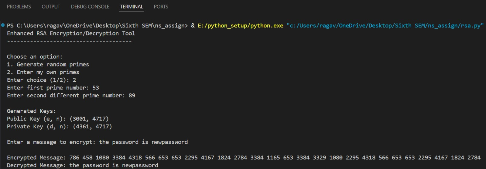
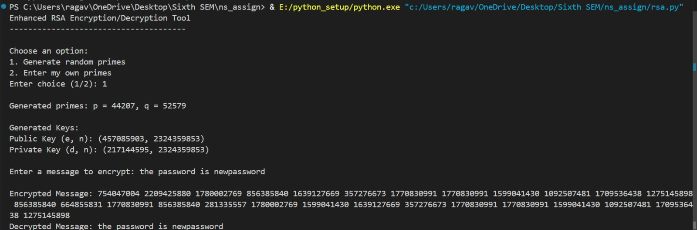

# RSA Encryption/Decryption Tool


A Python implementation of the RSA Algorithm for educational purposes.

## Table of Contents
- [Overview](#overview)
- [Features](#features)
- [Requirements](#requirements)
- [Usage](#usage)
- [Implementation Details](#implementation-details)
- [Limitations](#limitations)
- [Sample Output](#sample-output)


## Overview
This project demonstrates the RSA algorithm, a widely-used public-key cryptosystem for secure data transmission. The implementation allows users to:

- Generate RSA key pairs (public and private keys)
- Encrypt messages using the public key
- Decrypt messages using the private key
- Choose between auto-generated primes or user-provided primes

## Features
- Secure prime number generation using Miller-Rabin test
- Both automatic and manual prime number input
- Character-by-character encryption/decryption
- Clear display of generated keys
- Verification of decrypted messages

## Requirements
- Python 3.6 or higher
- No external dependencies (uses only standard library modules)

## Usage
 Download the rsa.py file and Run the program:
```bash
python rsa.py
```
You will be presented with the following options:

1. **Generate random primes**: The program will automatically generate secure prime numbers for key generation
2. **Enter my own primes**: You can provide your own prime numbers (must be valid primes)

After key generation:
- The program will display your public and private keys
- You can enter a message to encrypt
- The program will show the encrypted message
- Finally, it will decrypt the message to verify the process

## Implementation Details

Key components of the implementation:

- **Prime number generation**: Uses Miller-Rabin primality test for reliable prime checking
- **Key generation**: Implements standard RSA key pair generation
- **Encryption/Decryption**: Performs modular exponentiation for cryptographic operations
- **Security**: Uses cryptographically secure random number generation where needed

## Limitations 

This implementation is designed for educational purposes and has some intentional simplifications:

- Uses relatively small prime numbers (16-bit by default)
- Encrypts character-by-character rather than using proper padding schemes
- Not suitable for production use without significant modifications

For real-world applications, consider using established cryptographic libraries that implement RSA with:

- Larger key sizes (2048-bit or more)
- Proper padding schemes (OAEP)
- Protection against side-channel attacks
## Sample Output
Here is an example of the output generated by the RSA Encryption/Decryption tool:



